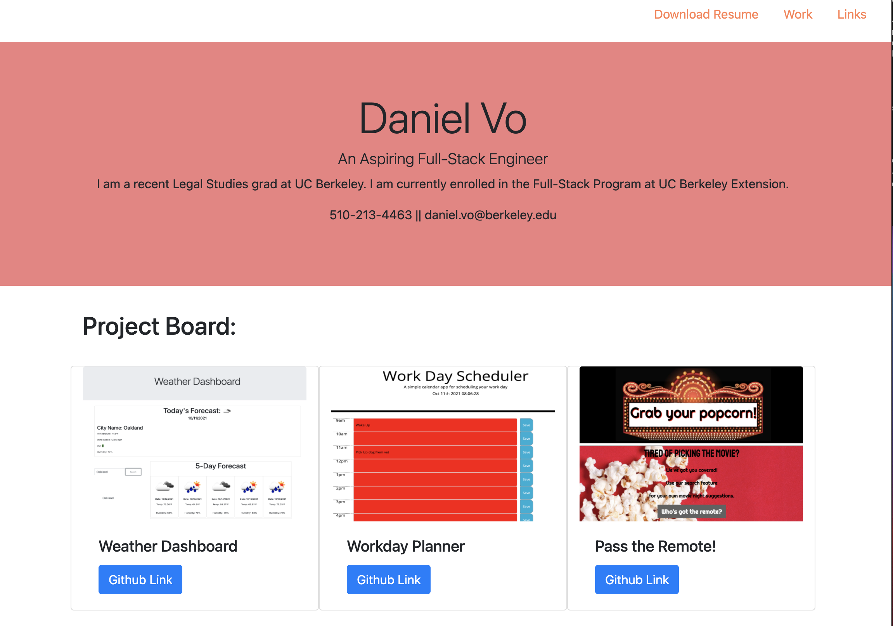

# Portfolio v2
I was tasked to make another portfolio using more of my own projects. In addition use the new knowledge I have learned to develop a better portfolio.
## Site Picture 

## Technologies 
- Git 
- CSS
- HTML 
- Javascript 
- Typeit (text animation)
- Bootstrap
- Jquery 

## Steps 
I wanted to create a impressionable front page. So I included an animated text for my landing page. At the end of the animation, the user will get the opportunity to see the rest of the porfolio by entering 'Enter'. I did this by using a text animation Library typeit. After completing the landing page, I added the format of the main page using bootstrap. Following creating the main struture of the page, I added details and uploded images and links to the appropriate url. Furthermore, I included my resume at the top in the nav bar to be downloaded. Finally, I finished by adding links to my professional pages. 

## Author Links
[LinkedIn](https://www.linkedin.com/in/daniel-vo-57b00521b/)
[GitHub](https://github.com/danielvo1)

## Deployable Lin
[Check Me Out](https://danielvo1.github.io/portfolio_v2/)